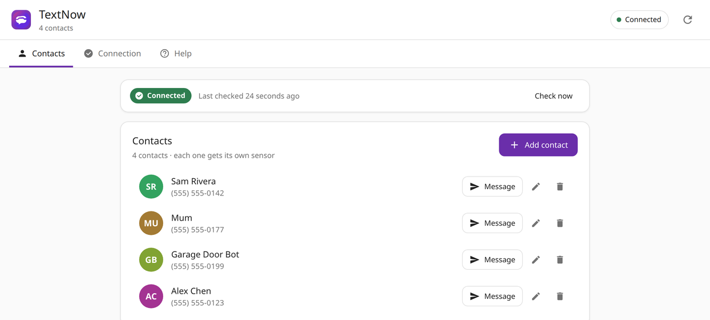
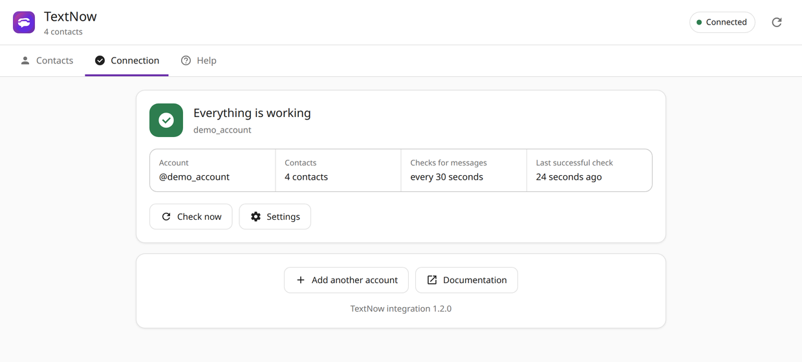
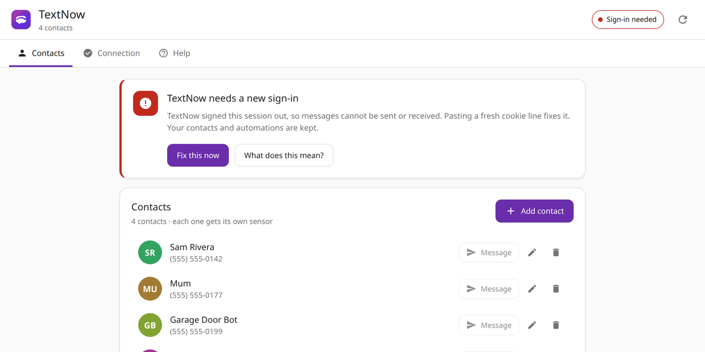
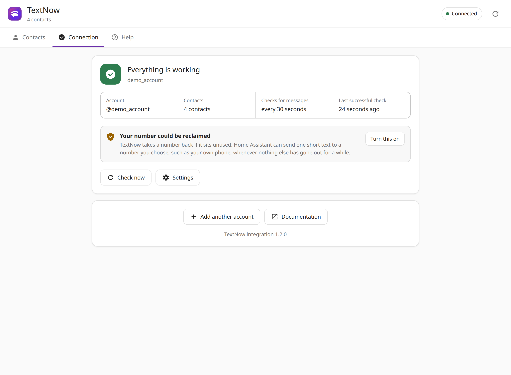

# TextNow Home Assistant Integration

<div align="center">


**Send and receive SMS/MMS messages through TextNow. Create interactive SMS menus for smart home control.**

[](https://github.com/zodyking/Home-Assistant-TextNow/releases)
[](LICENSE)
[](https://hacs.xyz)

</div>

---

## Table of Contents

- [Features](#features)
- [Installation](#installation)
- [Initial Configuration](#initial-configuration)
  - [Getting your cookies](#getting-your-cookies)
  - [When the session expires](#when-the-session-expires)
- [The TextNow panel](#the-textnow-panel)
- [Keeping your TextNow number](#keeping-your-textnow-number)
- [Managing Contacts](#managing-contacts)
- [Services](#services)
  - [textnow.send](#textnowsend)
  - [textnow.send_menu](#textnowsend_menu)
- [Triggers](#triggers)
  - [SMS Message Received](#sms-message-received)
  - [Phrase Received in SMS](#phrase-received-in-sms)
- [Automation Examples](#automation-examples)
- [Template Variables](#template-variables)
- [Troubleshooting](#troubleshooting)
- [Upgrading to 1.2.0](#upgrading-to-120)

---

## Features

| Feature | Description |
|---------|-------------|
| **Send SMS** | Send text messages to any contact |
| **Send MMS** | Send images with optional captions |
| **Send Voice Messages** | Send audio files as voice messages |
| **Interactive Menus** | Send numbered menus, wait for response, take action |
| **Message Triggers** | Trigger automations when any contact texts you |
| **Phrase Triggers** | Trigger automations when a specific phrase is received |
| **Auto-Reply** | Automatically reply to whoever triggered the automation |
| **Contact Sensors** | Track message history per contact |
| **Connection Status** | `sensor.textnow_status` plus a repair notice and re-auth prompt when the session expires |

---

## Installation

### HACS Installation (Recommended)

1. Open **HACS** → **Integrations**
2. Click **⋮** menu → **Custom repositories**
3. Enter URL: `https://github.com/zodyking/Home-Assistant-TextNow`
4. Select Category: **Integration**
5. Click **Add**
6. Find "TextNow" → Click **Download**
7. **Restart Home Assistant**

### Manual Installation

1. Download the `custom_components/textnow` folder
2. Copy to `config/custom_components/`
3. Restart Home Assistant

---

## Initial Configuration

TextNow has no public API and no app password, so Home Assistant signs in by
reusing the cookies from a browser that is already signed in. There is no
username/password option: TextNow's login is protected by PerimeterX bot
detection, which blocks scripted sign-ins (see
[Why cookies and not a password](#why-cookies-and-not-a-password)).

### Getting your cookies

The quickest way needs no understanding of HTTP headers — five clicks and one
paste:

1. Sign in to [textnow.com](https://www.textnow.com) in a desktop browser
   (Chrome, Edge or Firefox).
2. Press **F12** to open developer tools, then pick the **Network** tab.
3. Reload the page (**F5**), then type `messages` in the filter box.
4. Right-click the first row in the list and choose **Copy** → **Copy as cURL**.
5. In Home Assistant, go to **Settings** → **Devices & Services** →
   **+ Add Integration** → **TextNow**, paste into the **Cookies** box and
   press **Submit**.

Leave **Username** empty: it is read from the pasted request. Nothing else
needs to be picked out of the paste — the cookies the integration needs
(`connect.sid`, `_csrf`, `XSRF-TOKEN`) plus TextNow's bot-protection cookies
are extracted for you, and the credentials are checked against TextNow before
the entry is created, so a bad paste is reported immediately instead of
failing silently later.

> `Copy as cURL` output contains your live session. Treat it like a password:
> paste it straight into Home Assistant and don't share it anywhere else.

### If you prefer copying the cookie line

In the same request row, open **Request headers**, find the **cookie** line and
copy all of it. The **Cookies** box also accepts:

| What you paste | Works |
|----------------|-------|
| `Copy as cURL` command | ✅ username detected too |
| The whole `cookie:` header line | ✅ |
| The devtools **Application → Cookies** table (tab separated rows) | ✅ |
| A JSON export from a cookie manager extension | ✅ |
| `document.cookie` from the console | ⚠️ usually **not** enough — `connect.sid` is HttpOnly and hidden from the console |

When you paste a plain cookie line, fill in **Username** with the name from
**Settings → Account** on textnow.com (not your email address).

### When the session expires

TextNow signs saved sessions out eventually. When that happens the integration
does not go quiet:

- Polling stops instead of retrying a rejected session thousands of times a day
- A repair notice appears in **Settings** → **Devices & Services**
- The integration asks for re-authentication: paste a fresh cookie line and
  everything resumes. **Your contacts, entities and automations are kept** —
  there is no need to delete and re-add the integration
- `sensor.textnow_status` reads `New cookies needed`, so it can be used in a
  dashboard card or an alert automation

---

## The TextNow panel

After the first account is added, **TextNow** appears in the Home Assistant
sidebar. It is the one place that answers "is this working?" and "who can it
text?", and it needs no YAML.



**Contacts** lists everyone the integration can text. Each row sends a
message, edits the name or number, or removes the contact. Adding one is a
name and ten digits; the number is formatted as it is typed and each contact
gets its own sensor.

**Connection** shows the account, when messages were last checked, how often
they are being checked right now, whether the number is being kept in use, and
the last error if there was one.



**Help** has the five-step cookie walkthrough, so the instructions are still
reachable when the integration is the only thing you have open.

The panel works in light and dark themes, follows the theme's colours, and is
laid out for a phone as well as a desktop.

### Seeing the status at a glance

Every state is written out in plain language rather than left to a colour.



| Status | What it means |
|--------|---------------|
| **Connected** | Messages are being sent and received |
| **Sign-in needed** | TextNow signed the saved session out; paste a fresh cookie line to fix it |
| **Offline** | TextNow could not be reached; Home Assistant is retrying on its own, waiting longer after each failure |
| **Not running** | The account is switched off or failed to start |

An account that needs a new sign-in keeps its panel, its contacts and its
automations. **Fix this now** goes straight to the re-authentication prompt.

---

## Keeping your TextNow number

A free TextNow number is only yours while it is being used. Leave it idle and
TextNow returns it to the pool, which costs you the number your contacts reply
to and breaks every automation pointed at it.

Only **sending** counts. Receiving messages does not. That makes the risk worst
for exactly the setups that need the integration most: a number reserved for
power cuts, water leaks or alarms can quietly expire in between the emergencies
it exists for.

The integration can guard against this. Go to **Settings** → **Devices &
Services** → **TextNow** → **Configure** → **Keep the number in use**:

| Setting | Meaning |
|---------|---------|
| **Send it to** | A contact, or any 10-digit number. Your own phone is the usual choice. Leave it empty to turn the whole thing off |
| **Only when nothing was sent for** | How many idle days may pass first. Default 5, adjustable from 1 to 30 |
| **Message to send** | The text itself. The default says where it came from so it does not read as spam |

Anything the account sends resets the clock — a service call, a menu, an MMS,
or a message sent from the panel. A house whose automations text every couple
of days will never send one of these.

The default is five days rather than seven on purpose: TextNow does not publish
how long a number may sit idle and the rule has changed over the years, so the
default leaves margin instead of sitting on the edge of it.

The Connection tab says so when nothing is guarding the number:



Once it is turned on, the same place shows when the last message went out and
when the next one is due, with a **Send one now** button to test it.

A keep-alive cannot run while the session is expired, which is the moment the
number is most at risk, so the panel says the keep-alive is paused rather than
claiming the number is safe. Fixing the sign-in is what protects it. `sensor.textnow_status` carries the same information in its
`last_message_sent`, `keepalive_phone` and `keepalive_due` attributes, so an
automation can watch it.

---

## Managing Contacts

From the panel: open **TextNow** in the sidebar, then **Add contact** on the
Contacts tab. Enter a name and a 10-digit number and it is saved right away.

From the settings pages: **Settings** → **Devices & Services** → **TextNow** →
**Configure** → **Contacts**, which can also add, edit and remove contacts.

Each contact creates a sensor: `sensor.textnow_<name>`

---

## Services

### textnow.send

Send an SMS, MMS, or voice message to a contact.


#### Fields

| Field | Required | Description |
|-------|----------|-------------|
| **Contact** | No | Check to select a contact. **Leave unchecked to auto-reply to trigger sender.** |
| **Message** | No* | Text message content |
| **Image** | No* | File path for MMS image |
| **Audio file** | No* | File path for voice message |

*At least one of Message, Image, or Audio file is required.

#### Auto-Reply Feature

When the **Contact checkbox is unchecked**, the service automatically replies to whoever triggered the automation. This works seamlessly with the TextNow triggers.

#### Examples

**Send to specific contact (checkbox checked):**
```yaml
service: textnow.send
data:
  contact_id: sensor.textnow_john
  message: "Hello from Home Assistant!"
```

**Auto-reply to trigger sender (checkbox unchecked):**
```yaml
# No contact_id needed - replies to whoever sent the triggering message
service: textnow.send
data:
  message: "Got your message!"
```

**Send MMS with image:**
```yaml
service: textnow.send
data:
  contact_id: sensor.textnow_john
  message: "Check out this photo!"
  mms_image: /config/www/images/photo.jpg
```

**Send voice message:**
```yaml
service: textnow.send
data:
  contact_id: sensor.textnow_john
  voice_audio: /config/www/audio/message.mp3
```

---

### textnow.send_menu

Send an interactive numbered menu and wait for the user's response.


#### Fields

| Field | Required | Default | Description |
|-------|----------|---------|-------------|
| **Contact** | No | - | Check to select contact. Unchecked = auto-reply to trigger sender |
| **Menu Options** | Yes | - | One option per line |
| **Include Header** | No | On | Show header before options |
| **Header Text** | No | "Please select an option:" | Header text |
| **Include Footer** | No | On | Show footer after options |
| **Footer Text** | No | "Reply with the number of your choice" | Footer text |
| **Timeout** | No | 30 | Seconds to wait for response |
| **Number Format** | No | "{n}. {option}" | Format for each option |

#### How It Works

1. Service sends the menu as SMS
2. Service **waits** for user to reply
3. User replies with a number (1, 2, 3...)
4. Service returns the response
5. Your automation continues based on their choice

#### Menu Message Example

```
Please select an option:

1. Turn on lights
2. Turn off lights
3. Lock all doors

Reply with the number of your choice
```

#### Response Variable

Use `response_variable` to capture the response:

```yaml
service: textnow.send_menu
data:
  options: |
    Turn on lights
    Turn off lights
response_variable: user_choice
```

The response contains:

| Field | Description |
|-------|-------------|
| `option` | Selected number (1, 2, 3...) |
| `option_index` | Zero-based index (0, 1, 2...) |
| `value` | Text of selected option |
| `raw_text` | What user typed |
| `timed_out` | True if no response before timeout |

#### Examples

**Basic menu with auto-reply:**
```yaml
service: textnow.send_menu
data:
  options: |
    Turn on lights
    Turn off lights
    Check status
  timeout: 60
response_variable: choice
```

**Custom header and footer:**
```yaml
service: textnow.send_menu
data:
  contact_id: sensor.textnow_john
  header: "🏠 Smart Home Control"
  options: |
    Living room ON
    Living room OFF
    All lights OFF
  footer: "Reply 1-3"
response_variable: choice
```

---

## Triggers

TextNow provides two device triggers for automations.

### SMS Message Received

Fires when **any contact** sends you a message.


#### Setup

1. Create new automation
2. **Add Trigger** → **Device**
3. Select **TextNow** device
4. Choose **SMS message received**

#### Available Variables

| Variable | Description |
|----------|-------------|
| `{{ trigger.contact_name }}` | Sender's name |
| `{{ trigger.contact_id }}` | Contact ID (for replies) |
| `{{ trigger.message }}` | Message text |
| `{{ trigger.phone }}` | Phone number |

#### YAML Example

```yaml
automation:
  - alias: "Log incoming SMS"
    trigger:
      - platform: device
        domain: textnow
        device_id: <your_device_id>
        type: message_received
    action:
      - service: logbook.log
        data:
          name: "SMS"
          message: "{{ trigger.contact_name }}: {{ trigger.message }}"
```

---

### Phrase Received in SMS

Fires when a message contains a **specific phrase**.


#### Setup

1. Create new automation
2. **Add Trigger** → **Device**
3. Select **TextNow** device
4. Choose **Phrase received in SMS**
5. Enter the **Phrase to match**

#### Matching Rules

- **Case-insensitive**: "LIGHTS" matches "lights"
- **Anywhere in message**: "turn on the lights please" matches phrase "lights"

#### Additional Variable

| Variable | Description |
|----------|-------------|
| `{{ trigger.matched_phrase }}` | The phrase that matched |

#### YAML Example

```yaml
automation:
  - alias: "Lights on via SMS"
    trigger:
      - platform: device
        domain: textnow
        device_id: <your_device_id>
        type: phrase_received
        phrase: "lights on"
    action:
      - service: light.turn_on
        target:
          entity_id: light.living_room
      - service: textnow.send
        data:
          message: "Lights turned on! 💡"
```

---

## Automation Examples

### Interactive Menu Control

When anyone texts "menu", send them a control menu:

```yaml
automation:
  - alias: "SMS Menu Control"
    trigger:
      - platform: device
        domain: textnow
        device_id: <your_device_id>
        type: phrase_received
        phrase: "menu"
    action:
      - service: textnow.send_menu
        data:
          header: "🏠 Home Control"
          options: |
            Turn on lights
            Turn off lights
            Lock doors
          timeout: 60
        response_variable: choice
      
      - choose:
          - conditions: "{{ choice.option == 1 }}"
            sequence:
              - service: light.turn_on
                target:
                  entity_id: light.living_room
              - service: textnow.send
                data:
                  message: "✅ Lights ON"
          
          - conditions: "{{ choice.option == 2 }}"
            sequence:
              - service: light.turn_off
                target:
                  entity_id: light.living_room
              - service: textnow.send
                data:
                  message: "✅ Lights OFF"
          
          - conditions: "{{ choice.option == 3 }}"
            sequence:
              - service: lock.lock
                target:
                  entity_id: lock.front_door
              - service: textnow.send
                data:
                  message: "🔒 Doors locked"
          
          - conditions: "{{ choice.timed_out }}"
            sequence:
              - service: textnow.send
                data:
                  message: "⏰ Menu timed out"
```

### Home Status Report

```yaml
automation:
  - alias: "SMS Status"
    trigger:
      - platform: device
        domain: textnow
        device_id: <your_device_id>
        type: phrase_received
        phrase: "status"
    action:
      - service: textnow.send
        data:
          message: >
            🏠 HOME STATUS
            🌡️ Inside: {{ states('sensor.indoor_temp') }}°F
            💡 Lights on: {{ states.light | selectattr('state', 'eq', 'on') | list | count }}
            🔒 Door: {{ states('lock.front_door') }}
```

### Security Alert with Photo

```yaml
automation:
  - alias: "Motion Alert"
    trigger:
      - platform: state
        entity_id: binary_sensor.motion
        to: "on"
    action:
      - service: camera.snapshot
        target:
          entity_id: camera.front_door
        data:
          filename: /config/www/snapshot.jpg
      - delay: 2
      - service: textnow.send
        data:
          contact_id: sensor.textnow_john
          message: "🚨 Motion detected!"
          mms_image: /config/www/snapshot.jpg
```

---

## Template Variables

### Trigger Variables

| Variable | Example | Description |
|----------|---------|-------------|
| `{{ trigger.contact_name }}` | "John" | Sender's name |
| `{{ trigger.contact_id }}` | "contact_john" | Contact ID |
| `{{ trigger.message }}` | "Hello" | Message text |
| `{{ trigger.phone }}` | "+15551234567" | Phone number |
| `{{ trigger.matched_phrase }}` | "lights on" | Matched phrase (phrase trigger only) |

### Response Variables (send_menu)

| Variable | Example | Description |
|----------|---------|-------------|
| `{{ choice.option }}` | `1` | Selected option number |
| `{{ choice.option_index }}` | `0` | Zero-based index |
| `{{ choice.value }}` | "Turn on lights" | Option text |
| `{{ choice.raw_text }}` | "1" | User's reply |
| `{{ choice.timed_out }}` | `false` | True if timeout |

---

## Sensor Entities

Each contact creates a sensor: `sensor.textnow_<contact_name>`

### Attributes

| Attribute | Description |
|-----------|-------------|
| `phone` | Contact's phone number |
| `last_inbound` | Last received message |
| `last_inbound_ts` | Timestamp of last received |
| `last_outbound` | Last sent status |
| `last_outbound_ts` | Timestamp of last sent |

---

## Troubleshooting

### Checking the connection

| Where | What it tells you |
|-------|-------------------|
| `sensor.textnow_status` | `Connected`, `Disconnected` or `New cookies needed` |
| TextNow sidebar panel → **Status** | Per-account state, polling interval and the last error |
| **Settings** → **Devices & Services** | A repair notice when the session needs renewing |
| Integration → **⋮** → **Download diagnostics** | State for a bug report, with cookies, username and phone numbers redacted |

### Triggers Not Firing

1. Ensure sender is a saved contact
2. Check phrase is in the message (case-insensitive)
3. Enable debug logging:

```yaml
logger:
  logs:
    custom_components.textnow: debug
```

### Authentication Errors

The integration reports two different failures, because they need different
fixes:

- **`New cookies needed` / HTTP 401** — the saved session expired. Paste a
  fresh cookie line into the re-authentication prompt.
- **HTTP 403 with bot protection** — PerimeterX rejected the request. Sign in
  to TextNow in a normal browser, solve any challenge it shows, then paste a
  fresh `Copy as cURL` (it carries the bot-protection cookies as well).
  Raising the polling interval in the integration options makes this rarer.

Polling stops on both, so a broken session logs one message rather than
filling the log.

### Menu Not Waiting

- Increase `timeout` value
- Verify `response_variable` is set

### Why cookies and not a password

TextNow's sign-in page is behind PerimeterX bot detection, which is designed
to block exactly what a Home Assistant integration would have to do. An
email/password login would work on some networks and fail on others, and would
break whenever the challenge changes — so this integration does not pretend to
offer one. Reusing a browser session is the honest trade-off: one paste, and
the session is then kept alive automatically for as long as TextNow allows.

### Why messages are polled

TextNow's web client keeps a push channel open, but it is undocumented and
authenticated separately, and getting it wrong means silently receiving
nothing. Until that channel can be verified against a live account, receiving
uses polling, with every rotated session cookie followed so the session stays
valid, and backoff so failures do not turn into thousands of requests.
`Check for new messages every` in the integration options controls the
trade-off between how fast messages arrive and how much traffic TextNow sees.

### Finding Device ID

1. Go to **Settings** → **Devices & Services** → **TextNow**
2. Click the TextNow device
3. Device ID is in the URL

---

## Requirements

- Home Assistant 2024.11.0+
- Valid TextNow account
- Active browser session cookies

---

## Upgrading to 1.2.0

**Contact sensors are renamed.** Entity IDs used to be built from the device
name and a duplicated prefix, producing IDs such as
`sensor.sms_text_messages_textnow_textnow_sam`. They are now
`sensor.textnow_<contact>`, for example `sensor.textnow_sam`.

Existing sensors are renamed automatically on the first start after the
update, once per account. **Automations, scripts and dashboards that reference
the old entity IDs must be updated**, so check for the old names after
updating (Developer tools → Template, or search your YAML for `textnow_`).
Nothing else is lost: contacts, the device, and its triggers keep working, and
a sensor that had been renamed by hand is left alone.

Also new in 1.2.0:

- `sensor.textnow_status` reports the connection state
- Expired sessions raise a repair notice and a re-authentication prompt
  instead of silently logging 401s
- Diagnostics can be downloaded from the integration page
- An optional keep-alive message stops TextNow reclaiming an idle number, see
  [Keeping your TextNow number](#keeping-your-textnow-number)

---

## Support

- [GitHub Issues](https://github.com/zodyking/Home-Assistant-TextNow/issues)
- [GitHub Discussions](https://github.com/zodyking/Home-Assistant-TextNow/discussions)

---

Made with ❤️ for the Home Assistant community
